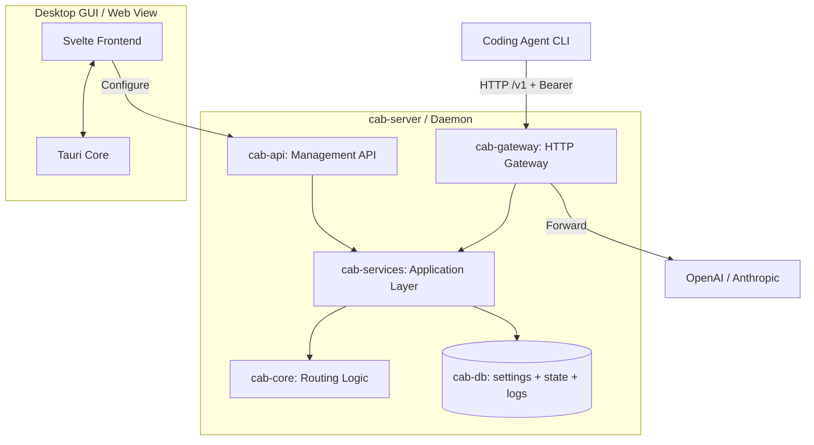

# CAB (Coding Agents Bridge)

[English](README.md) | [简体中文](https://xiongdi.github.io/cab/zh-cn/) | [Documentation](https://xiongdi.github.io/cab/)

CAB (Coding Agents Bridge) is a local, cost-aware LLM gateway router designed for coding agents and developer workflows. Point your agent CLI at the CAB gateway (`http://localhost:3125/v1` by default); CAB ranks and forwards requests to the best enabled provider/model for each prompt.

---

## Features

- **OpenAI / Anthropic gateway**: Exposes `/v1/chat/completions`, `/v1/messages`, and `/v1/responses` on a single local HTTP port.
- **Ability & cost-aware routing**: Ranks models using Intelligence / Coding / Agentic indices, token pricing, and context window.
- **Real-time catalog sync**: Pulls models, pricing, and benchmark data from `models.dev`.
- **Desktop dashboard**: Tauri + Svelte UI for providers, keys, routing strategies, agent config, and request logs.
- **Agent config switcher**: Auto/Manual modes rewrite configs for Claude Code, Codex, OpenCode, Hermes, Kilo Code, OpenClaw, and Pi.

---

## System Architecture



| Crate          | Role                                             |
| -------------- | ------------------------------------------------ |
| `cab-core`     | Types, request profiling, routing algorithm      |
| `cab-db`       | Store, `settings.json`, `state.json`, JSONL logs |
| `cab-services` | Catalog sync, route resolution, agent config     |
| `cab-gateway`  | Auth, protocol adapters, upstream forwarding     |
| `cab-api`      | Management REST API (`/api/*`)                   |
| `cab-server`   | Headless daemon (gateway + API + static UI)      |
| `src`          | Svelte dashboard                                 |

> **v0.2.0** adds persistent agent/route config, Gateway auth, JSONL logs, and routing explain API. See [CHANGELOG](CHANGELOG.md).

---

## Getting Started

**Install a release:** see the [official docs](https://xiongdi.github.io/cab/getting-started/install/) ([中文](https://xiongdi.github.io/cab/zh-cn/getting-started/install/)) on [GitHub Releases](https://github.com/xiongdi/cab/releases).

### Prerequisites

- [Rust](https://rustup.rs/) (2024 Edition, `stable` via `rust-toolchain.toml`)
- [Node.js](https://nodejs.org/) (v24+, LTS)

### Desktop GUI (Tauri)

```bash
npm install
npm run tauri:dev
```

### Headless server

```bash
cargo run -p cab-server
```

Default gateway: `http://127.0.0.1:3125/v1`

---

## Supported coding agents (v0.1.0)

| Agent       | Integration                        |
| ----------- | ---------------------------------- |
| Claude Code | `~/.claude/settings.json`          |
| Codex       | `~/.codex/config.toml`             |
| OpenCode    | `~/.config/opencode/opencode.json` |
| Hermes      | `~/.hermes/config.yaml`            |
| Kilo Code   | `~/.config/kilo/opencode.json`     |
| OpenClaw    | `openclaw config`                  |
| Pi          | `~/.pi/agent/models.json`          |

Configure modes in the **Agents** page: **Native** (bypass CAB), **Auto** (routing strategy), **Manual** (expose all enabled models).

---

## License

[MIT License](LICENSE)
