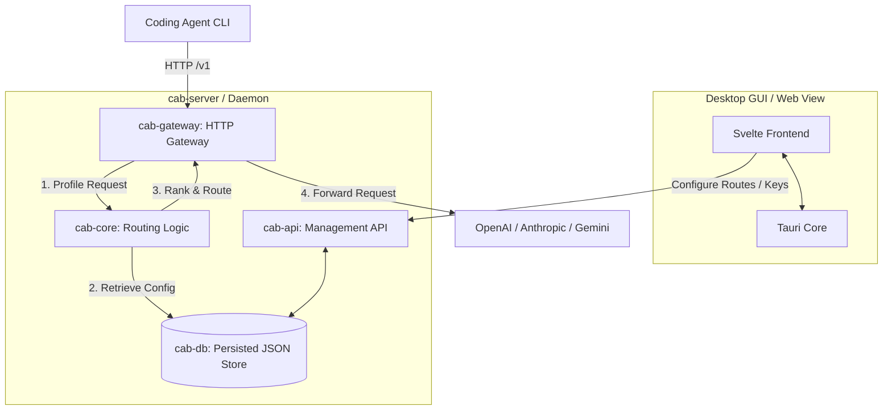

# CAB (Coding Agents Bridge)

[English](README.md) | [简体中文](docs/README.zh-CN.md) | [日本語](docs/README.ja.md) | [한국어](docs/README.ko.md) | [Español](docs/README.es.md)

CAB (Coding Agents Bridge) is a local, cost-aware LLM gateway router designed for coding agents and developer workflows. Point your agent CLI at the CAB gateway (`http://localhost:3125/v1` by default); CAB ranks and forwards requests to the best enabled provider/model for each prompt.

---

## Features

- **OpenAI / Anthropic / Gemini gateway**: Exposes `/v1/chat/completions`, `/v1/messages`, `/v1/responses`, and Gemini-compatible endpoints on a single local HTTP port.
- **Ability & cost-aware routing**: Ranks models using Intelligence / Coding / Agentic indices, token pricing, and context window.
- **Real-time catalog sync**: Pulls models, pricing, and benchmark data from `models.dev`.
- **Desktop dashboard**: Tauri + Svelte UI for providers, keys, routing strategies, agent config, and request logs.
- **Agent config switcher**: Auto/Manual modes rewrite configs for Claude Code, Codex, OpenCode, Hermes, Kilo Code, OpenClaw, and Pi.

---

## System Architecture



| Crate | Role |
| --- | --- |
| `cab-core` | Types, request profiling, routing algorithm |
| `cab-db` | In-memory store + `~/.cab/settings.json` persistence |
| `cab-gateway` | HTTP gateway, protocol translation, upstream forwarding |
| `cab-api` | Management REST API (`/api/*`) |
| `cab-server` | Headless daemon (gateway + API + static UI) |
| `src` | Svelte dashboard |

---

## Getting Started

### Prerequisites

- [Rust](https://rustup.rs/) (2024 Edition)
- [Node.js](https://nodejs.org/) (v18+)

### Desktop GUI (Tauri)

```bash
npm install
npm run tauri:dev
```

### Headless server

```bash
cargo run -p cab-server
```

Default gateway: `http://127.0.0.1:3125/v1`

---

## Supported coding agents (v0.1.0)

| Agent | Integration |
| --- | --- |
| Claude Code | `~/.claude/settings.json` |
| Codex | `~/.codex/config.toml` |
| OpenCode | `~/.config/opencode/opencode.json` |
| Hermes | `~/.hermes/config.yaml` |
| Kilo Code | `~/.config/kilo/opencode.json` |
| OpenClaw | `openclaw config` |
| Pi | `~/.pi/agent/models.json` |

Configure modes in the **Agents** page: **Native** (bypass CAB), **Auto** (routing strategy), **Manual** (expose all enabled models).

---

## License

[MIT License](LICENSE)
