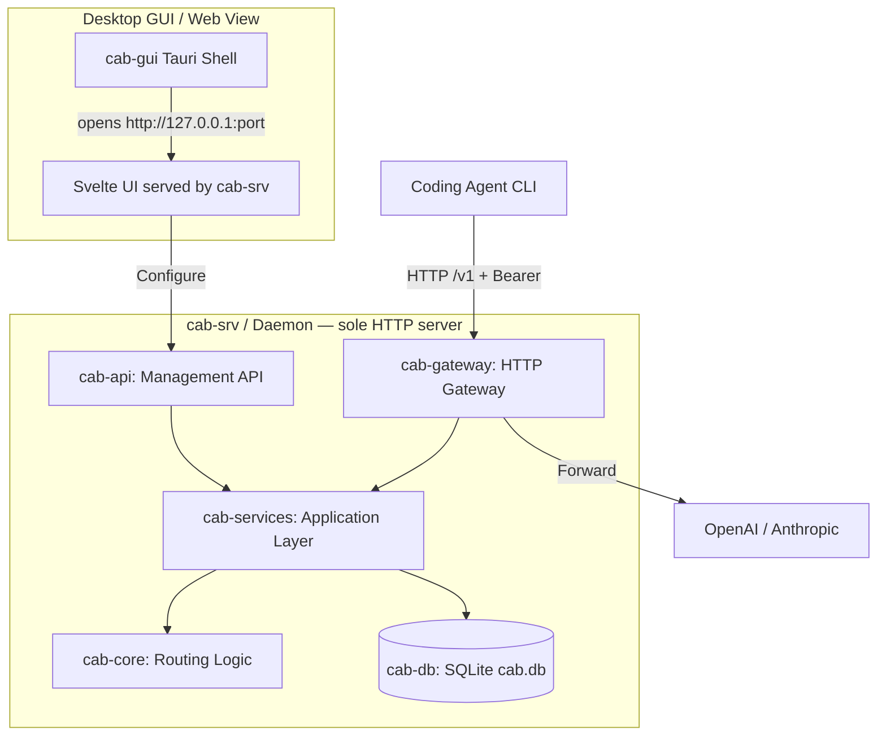

# CAB (Coding Agents Bridge)

[English](README.md) | [简体中文](https://xiongdi.github.io/cab/zh-cn/) | [Documentation](https://xiongdi.github.io/cab/)

CAB (Coding Agents Bridge) is a local, cost-aware LLM gateway router designed for coding agents and developer workflows. Point your agent CLI at the CAB gateway (`http://localhost:3125/v1` by default); CAB ranks and forwards requests to the best enabled provider/model for each prompt.

---

## Features

- **OpenAI / Anthropic gateway**: Exposes `/v1/chat/completions`, `/v1/messages`, and `/v1/responses` on a single local HTTP port.
- **Ability & cost-aware routing**: Ranks models using Intelligence / Coding / Agentic indices, token pricing, and context window.
- **Real-time catalog sync**: Pulls models, pricing, and benchmark data from `models.dev`.
- **Desktop dashboard**: Tauri + Svelte UI for providers, keys, routing strategies, agent config, and request logs.
- **Agent config switcher**: Auto/Manual modes rewrite configs for Claude Code, Codex, OpenCode, Hermes, Kilo Code, OpenClaw, Pi, and Reasonix.

---

## System Architecture



| Crate          | Role                                                           |
| -------------- | -------------------------------------------------------------- |
| `cab-core`     | Types, request profiling, routing algorithm                    |
| `cab-db`       | SQLite store (`~/.cab/cab.db`: settings, agents, routes, logs) |
| `cab-services` | Catalog sync, route resolution, agent config                   |
| `cab-gateway`  | Auth, protocol adapters, upstream forwarding                   |
| `cab-api`      | Management REST API (`/api/*`)                                 |
| `cab-srv`      | **Sole** HTTP daemon (gateway + API + static UI)               |
| `cab`          | CLI (`cab-cli`) for daemon control and management API          |
| `src`          | Svelte dashboard (served by `cab-srv`)                         |
| `src-tauri`    | Thin desktop shell — ensures `cab-srv` and opens its URL       |

> **Do not** run `cab-gui` and a second gateway on the same port: the GUI does not embed a server; it only talks to `cab-srv`. See [CHANGELOG](CHANGELOG.md).

---

## Getting Started

**Install a release:** see the [official docs](https://xiongdi.github.io/cab/getting-started/install/) ([中文](https://xiongdi.github.io/cab/zh-cn/getting-started/install/)) on [GitHub Releases](https://github.com/xiongdi/cab/releases).

### Prerequisites

- [Rust](https://rustup.rs/) (2024 Edition, `stable` via `rust-toolchain.toml`)
- [Node.js](https://nodejs.org/) (v24+, LTS)
- `cargo-watch` for backend hot reload: `cargo install cargo-watch`

### Daily development (two terminals)

The canonical dev workflow is defined in [AGENTS.md](AGENTS.md) — two processes, globally unique ports:

```bash
# Terminal A — backend (watch mode, port 3125)
npm run dev:server

# Terminal B — frontend (hot reload, port 5173)
npm run dev
```

Default gateway: `http://127.0.0.1:3125/v1`

> **Port conflicts**: never change ports or stack a second instance. Kill the occupying process first — see `scripts/kill-dev-ports.ps1`.

### Desktop GUI (Tauri)

The desktop app is a **thin client**: it ensures `cab-srv` is running and opens `http://127.0.0.1:{gateway_port}/`. It does **not** embed a second gateway (no port conflict with the daemon).

```bash
npm install
# Ensure cab-srv / npm run dev:server is available, then:
npm run tauri:dev
```

### Headless release binary

Install as a user or system service (not for daily `dev:server` workflow):

```bash
cab-cli service install --scope user     # ~/.cab — user service / LaunchAgent / Task Scheduler
# sudo cab-cli service install --scope system
#   Linux: systemd as user `cab` + hardening; macOS: LaunchDaemon as `_cab`;
#   Windows: SCM as LocalService (service-scoped env, not machine setx)
cab-cli start
# or foreground: cargo run -p cab-srv
```

See [Gateway & Auth](https://xiongdi.github.io/cab/guides/gateway-auth/) for scope / data paths.

---

## Supported coding agents

| Agent       | Integration                                   |
| ----------- | --------------------------------------------- |
| Claude Code | `~/.claude/settings.json`                     |
| Codex       | `~/.codex/config.toml`                        |
| OpenCode    | `~/.config/opencode/opencode.json`            |
| Hermes      | `~/.hermes/config.yaml`                       |
| Kilo Code   | `~/.config/kilo/opencode.json`                |
| OpenClaw    | `openclaw config`                             |
| Pi          | `~/.pi/agent/models.json`                     |
| Reasonix    | `~/.reasonix/config.toml`, `~/.reasonix/.env` |

Configure modes in the **Agents** page: **Native** (bypass CAB), **Auto** (routing strategy), **Manual** (expose all enabled models).

---

## License

[Auditable Commercial License (ACL) v1.0](LICENSE)
