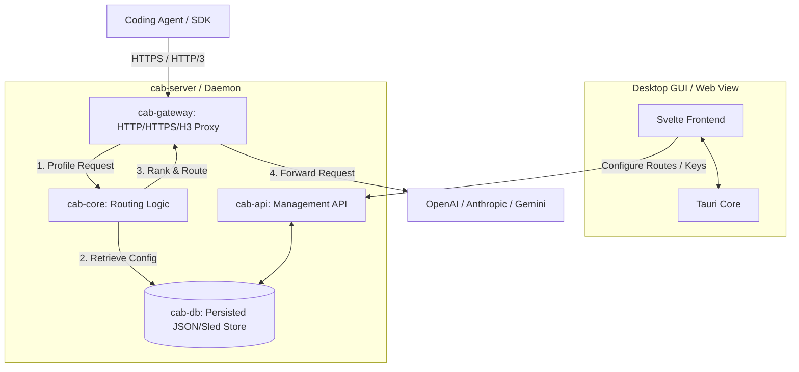

# CAB (Coding Agents Bridge)

CAB (Coding Agents Bridge) is a local, cost-aware LLM gateway router and proxy designed specifically for coding agents and developer workflows. By intercepting and routing requests dynamically, CAB bridges the gap between high-capability/high-cost LLMs (like GPT-4o, Claude 3.5 Sonnet) and cost-effective alternatives, ensuring your coding agents get the intelligence they need without breaking the bank.

---

## ✨ Features

- **🔌 Seamless Proxy Interception**: Intercepts requests targeting OpenAI, Anthropic, Gemini, and Google Cloud Code APIs transparently. Run officially-provided SDKs directly without modifying base URLs.
- **🧠 Ability & Cost-Aware Routing**: Routes requests dynamically by ranking models based on:
  - **Intelligence Indices** (Overall Intelligence, Coding Index, Agentic Index)
  - **Cost Profile** (Input/Output token prices)
  - **Context Window** requirements
- **📊 Real-time Catalog Sync**: Automatically synchronizes models, pricing, and benchmark data from `models.dev` to keep your local router up to date.
- **🖥️ Beautiful Desktop Dashboard**: A cross-platform desktop app (built with **Tauri** and **Svelte**) to configure providers, API keys, routing strategies, custom agent profiles, and inspect live proxy logs.
- **🔒 TLS 1.3 Local Gateway**: Built-in self-signed TLS certificate generation for secure, local HTTPS (`https://127.0.0.1:443`) and HTTP/3 (QUIC) interception.

---

## 🏗️ System Architecture

CAB is structured as a modular Rust workspace alongside a Svelte-based frontend:



* **`cab-core`**: Core models, request profiling, and the cost-intelligence ranking algorithm.
* **`cab-db`**: Local database and persistence layer.
* **`cab-gateway`**: High-performance HTTP/HTTPS proxy that translates protocols, manages connection pools, and performs routing.
* **`cab-api`**: Management API endpoints for controlling providers, keys, agents, and system logs.
* **`cab-server`**: The daemon wrapper combining the API, gateway, and static assets server.
* **`src`**: Svelte frontend providing the UI dashboard.

---

## 🚀 Getting Started

### Prerequisites

Ensure you have the following installed:
- [Rust](https://rustup.rs/) (2024 Edition)
- [Node.js](https://nodejs.org/) (v18+)
- OpenSSL (system library)

### Run with Desktop GUI (Tauri)

To launch the desktop dashboard:

1. Install dependencies:
   ```bash
   npm install
   ```
2. Start development mode:
   ```bash
   npm run tauri:dev
   ```

### Run Daemon Only (Headless Server)

To run the proxy server headless:
```bash
cargo run -p cab-server
```

---

## 🔒 Privileged Port Interception (Linux)

To support transparent proxy interception (e.g. routing Anthropic/OpenAI SDK calls without modifying the endpoint URLs), CAB can bind to `127.0.0.1:443` via a local DNS hijack (e.g., adding `127.0.0.1 api.anthropic.com` to `/etc/hosts`).

Since binding to port 443 requires elevated privileges on Linux, you can run CAB using the provided helper script which applies `setcap` to the binary:

```bash
./scripts/run-with-setcap.sh
```

---

## 📝 License

This project is licensed under the [MIT License](LICENSE).
