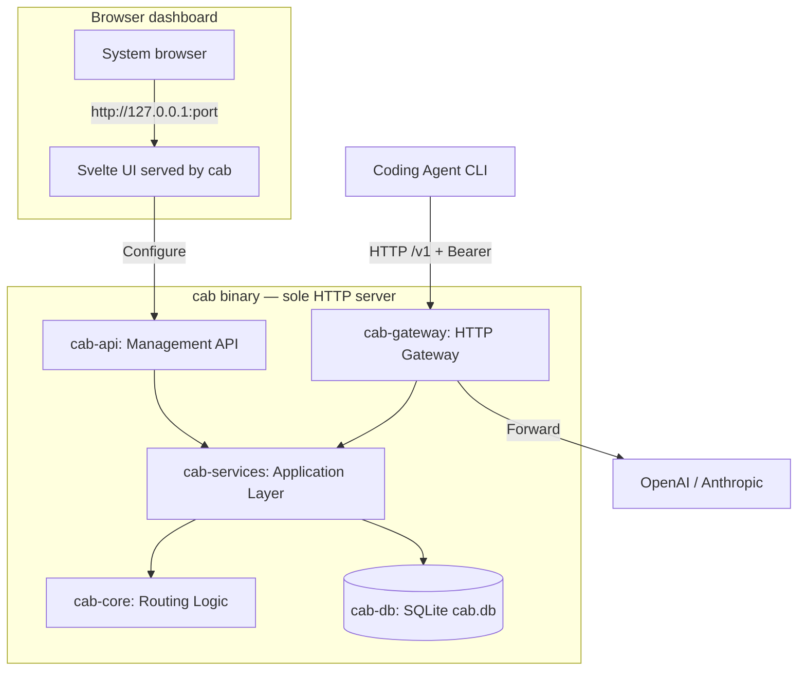

# CAB (Coding Agents Bridge)

[English](README.md) | [简体中文](https://xiongdi.github.io/cab/zh-cn/) | [Documentation](https://xiongdi.github.io/cab/)

CAB (Coding Agents Bridge) is a local, cost-aware LLM gateway router designed for coding agents and developer workflows. Point your agent CLI at the CAB gateway (`http://localhost:3125/v1` by default); CAB ranks and forwards requests to the best enabled provider/model for each prompt.

---

## Features

- **OpenAI / Anthropic gateway**: Exposes `/v1/chat/completions`, `/v1/messages`, and `/v1/responses` on a single local HTTP port.
- **Ability & cost-aware routing**: Ranks models using Intelligence / Coding / Agentic indices, token pricing, and context window.
- **Real-time catalog sync**: Pulls models, pricing, and benchmark data from `models.dev`.
- **Browser dashboard**: Svelte UI served by the gateway for providers, keys, routing strategies, agent config, and request logs.
- **Agent config switcher**: Auto/Manual modes rewrite configs for Claude Code, Codex, OpenCode, and Grok Build.

---

## System Architecture


```mermaid
graph TD
    subgraph Frontend [Browser dashboard]
        Browser[System browser]
        Svelte[Svelte UI served by cab]
        Browser -->|http://127.0.0.1:port| Svelte
    end

    subgraph Backend [cab binary — sole HTTP server]
        API[cab-api: Management API]
        Gateway[cab-gateway: HTTP Gateway]
        Services[cab-services: Application Layer]
        DB[(cab-db: SQLite cab.db)]
        Core[cab-core: Routing Logic]
    end

    AgentCLI[Coding Agent CLI] -- "HTTP /v1 + Bearer" --> Gateway
    Gateway --> Services
    Services --> Core
    Services --> DB
    Gateway -- "Forward" --> LLM[OpenAI / Anthropic]
    Svelte -- "Configure" --> API
    API --> Services
```

| Crate          | Role                                                           |
| -------------- | -------------------------------------------------------------- |
| `cab-core`     | Types, request profiling, routing algorithm                    |
| `cab-db`       | SQLite store (`~/.cab/cab.db`: settings, agents, routes, logs) |
| `cab-services` | Catalog sync, route resolution, agent config                   |
| `cab-gateway`  | Auth, protocol adapters, upstream forwarding                   |
| `cab-api`      | Management REST API (`/api/*`)                                 |
| `cab-srv`      | Library: combined HTTP app (used by `cab serve`)               |
| `cab`          | Single CLI/daemon binary (`cab`)                               |
| `src`          | Svelte dashboard (served by `cab serve`)                       |

---

## Getting Started

### One-line install

Install the single `cab` binary (+ dashboard UI) from [GitHub Releases](https://github.com/xiongdi/cab/releases).

**Linux / macOS / Git Bash**

```bash
curl -fsSL https://raw.githubusercontent.com/xiongdi/cab/main/scripts/install.sh | bash
# mirror: curl -fsSL https://xiongdi.github.io/cab/install.sh | bash
```

**Windows (PowerShell)**

```powershell
irm https://raw.githubusercontent.com/xiongdi/cab/main/scripts/install.ps1 | iex
# mirror: irm https://xiongdi.github.io/cab/install.ps1 | iex
```

Installs to `~/.cab/bin` (or `%USERPROFILE%\.cab\bin` on Windows), adds `cab` to your `PATH`, and runs `cab service install --scope user`.

```bash
cab status
cab gui                 # open dashboard in browser
cab update              # upgrade later
```

Installer options:

```bash
# bash
curl -fsSL …/install.sh | bash -s -- --version 0.9.0
curl -fsSL …/install.sh | bash -s -- --no-service --no-modify-path
```

```powershell
# PowerShell
powershell -NoProfile -ExecutionPolicy Bypass -File install.ps1 -Version 0.9.0
powershell -NoProfile -ExecutionPolicy Bypass -File install.ps1 -NoService -NoModifyPath
```

See the [install guide](https://xiongdi.github.io/cab/getting-started/install/) ([中文](https://xiongdi.github.io/cab/zh-cn/getting-started/install/)) for archives, system requirements, and troubleshooting.

### Prerequisites

- [Rust](https://rustup.rs/) (2024 Edition, `stable` via `rust-toolchain.toml`)
- [Node.js](https://nodejs.org/) (v24+, LTS)
- `cargo-watch` for backend hot reload: `cargo install cargo-watch`

### Daily development (two terminals)

The canonical dev workflow is defined in [AGENTS.md](AGENTS.md) — two processes, globally unique ports:

```bash
# Terminal A — backend (watch mode, port 3125)
npm run dev:server

# Terminal B — frontend (hot reload, port 5173)
npm run dev
```

Default gateway: `http://127.0.0.1:3125/v1`

> **Port conflicts**: never change ports or stack a second instance. Kill the occupying process first — see `scripts/kill-dev-ports.ps1`.

### Service / foreground daemon

```bash
cab service install --scope user     # ~/.cab — user service / LaunchAgent / Task Scheduler
# sudo cab service install --scope system
cab start
cab gui
# or foreground: cab serve
# or from source: cargo run -p cab --bin cab -- serve
```

See [Gateway & Auth](https://xiongdi.github.io/cab/guides/gateway-auth/) for scope / data paths.

---

## Supported coding agents

| Agent       | Integration                        |
| ----------- | ---------------------------------- |
| Claude Code | `~/.claude/settings.json`          |
| Codex       | `~/.codex/config.toml`             |
| OpenCode    | `~/.config/opencode/opencode.json` |
| Grok Build  | `~/.grok/config.toml`              |

Configure modes in the **Agents** page: **Native** (bypass CAB), **Auto** (routing strategy), **Manual** (expose all enabled models).

---

## License

[Auditable Commercial License (ACL) v1.0](LICENSE)
