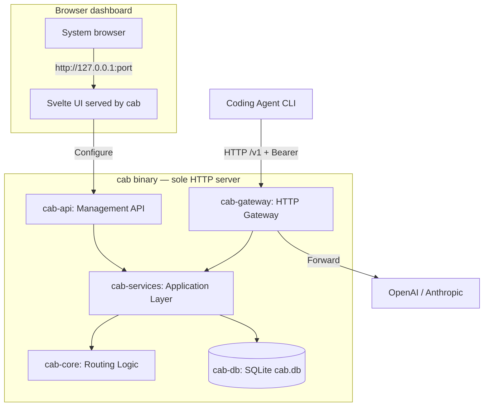

<div align="center">

# CAB — Coding Agents Bridge

**One local gateway for every coding agent. Smart, cost-aware LLM routing.**

[English](README.md) · [简体中文](README.zh-CN.md) · [Documentation](https://xiongdi.github.io/cab/) · [Changelog](https://xiongdi.github.io/cab/project/changelog/)

[](https://github.com/xiongdi/cab/releases)
[](https://github.com/xiongdi/cab/releases)
[](https://github.com/xiongdi/cab/releases)
[](LICENSE)
[](https://github.com/xiongdi/cab/actions/workflows/build-cli.yml)

</div>

CAB sits between your coding agent CLIs and upstream LLM providers — a single local gateway at `http://localhost:3125/v1`. Point Claude Code, Codex, OpenCode, or Grok Build at it; CAB ranks every request to the best enabled model for the job and forwards it to OpenAI / Anthropic. No more hand-editing JSON, TOML, or `.env` files, no more guessing which model is cheapest or fastest.

> **Why CAB?** Coding agents each expect their own API keys, endpoints, and model lists. CAB gives you **one endpoint, one key, one dashboard** for all of them — and routes each prompt by capability, benchmarks, and real token cost.

## Screenshots

| Dashboard                                          | Providers                                          |
| -------------------------------------------------- | -------------------------------------------------- |
|  |  |

| Models                                       | Routing                                       |
| -------------------------------------------- | --------------------------------------------- |
|  |  |

## Features

### Routing

- **6 built-in strategies** — auto, balanced, intelligent, price, speed, agentic — each ranking models on intelligence / coding / agentic indices, AA benchmarks, token pricing, and context window.
- **Cost-aware by default** — effective token cost blends `cache_read` pricing and a 10:1 input/output ratio, so "cheapest" actually means _cheapest for your workload_.
- **Request-aware profiles** — CAB infers task (coding / math / agentic / general) and complexity from each prompt, then applies the right strategy and capability floor.
- **Vision-capable routing** — requests that embed an image (screenshots, diagrams, UI mockups) route only to models that accept image input, even when a text-only model is cheaper.
- **Custom route rules** — glob-matched rules by agent with fallback chains, plus an "Explain routing" preview that shows exactly how a prompt resolves.

### Providers & catalog

- **Real-time models.dev sync** — models, pricing, and AA benchmarks pulled live; `architecture.modalities.input` data drives vision routing.
- **One key or many** — enable providers and models per request; keys rotate and cooldown on 429s with exponential backoff.
- **Endpoint-level pricing** — uses each provider's real endpoint cost from models.dev, not catalog defaults.

### Dashboard

- **Browser control plane** — Svelte UI served by the gateway: providers, models, routes, agents, request logs, and settings.
- **Usage & logs** — per-request provider, model, tokens (with cache legs normalized), latency, and cost.

### Agent switching

- **Auto / Manual / Native modes** — CAB rewrites `~/.claude/settings.json`, `~/.codex/config.toml`, `~/.config/opencode/opencode.json`, or `~/.grok/config.toml` for you, with config backups.
- **Model pinning** — in Manual mode, pin an agent to a specific model by name.

---

## Quick start

```bash
# Linux / macOS / Git Bash
curl -fsSL https://raw.githubusercontent.com/xiongdi/cab/main/scripts/install.sh | bash

# Windows (PowerShell)
irm https://raw.githubusercontent.com/xiongdi/cab/main/scripts/install.ps1 | iex
```

1. **Launch** — `cab status`, then `cab gui` to open the dashboard (or `cab serve` headless).
2. **Add a provider** — wait for the catalog to sync, enter API keys, enable providers/models.
3. **Copy your gateway key** — Settings → Gateway API Key (Bearer token for every request).
4. **Connect an agent** — Agents → pick Auto (apply a strategy) or Manual (expose all enabled models). CAB backs up and rewrites the agent config.
5. **Send a request** — run your agent CLI as usual. Check **Logs** to confirm the routed provider, model, tokens, and latency.

See the [Quick Start guide](https://xiongdi.github.io/cab/getting-started/quick-start/) ([中文](https://xiongdi.github.io/cab/zh-cn/getting-started/quick-start/)) for the full walkthrough.

---

## Routing strategies

| Strategy      | Primary key                        | Best for                                     |
| ------------- | ---------------------------------- | -------------------------------------------- |
| `auto`        | capability / effective cost        | Default — capable model without overspending |
| `balanced`    | capability / effective cost        | General-purpose, capability-then-cost        |
| `intelligent` | coding index                       | Hard code problems, ranked by coding ability |
| `agentic`     | agentic index                      | Long-horizon agentic workflows               |
| `cheapest`    | effective cost                     | Batch / cost-sensitive workloads             |
| `speed`       | TTFT + 1000 / output_speed_tps (s) | Interactive, latency-sensitive sessions      |

Missing primary data sinks to the bottom in both directions; ties break on model name then provider. See the [Routing guide](https://xiongdi.github.io/cab/guides/routing/) for the ranking formulas.

---

## Supported coding agents

| Agent       | Config path                        |
| ----------- | ---------------------------------- |
| Claude Code | `~/.claude/settings.json`          |
| Codex       | `~/.codex/config.toml`             |
| OpenCode    | `~/.config/opencode/opencode.json` |
| Grok Build  | `~/.grok/config.toml`              |

Agents are identified by their User-Agent string at the gateway. See the [Supported agents](https://xiongdi.github.io/cab/reference/supported-agents/) reference for per-agent behavior and config backup.

---

## Install

### One-line install

```bash
# Linux / macOS / Git Bash
curl -fsSL https://raw.githubusercontent.com/xiongdi/cab/main/scripts/install.sh | bash
# mirror: curl -fsSL https://xiongdi.github.io/cab/install.sh | bash
```

```powershell
# Windows (PowerShell)
irm https://raw.githubusercontent.com/xiongdi/cab/main/scripts/install.ps1 | iex
# mirror: irm https://xiongdi.github.io/cab/install.ps1 | iex
```

Installs to `~/.cab/bin` (or `%USERPROFILE%\.cab\bin` on Windows), adds `cab` to `PATH`, and runs `cab service install --scope user`. Linux archives are fully static (musl) — no glibc version floor.

```bash
cab status
cab gui          # open dashboard in browser
cab update       # upgrade later
```

Installer options:

```bash
# bash
curl -fsSL …/install.sh | bash -s -- --version 0.9.0
curl -fsSL …/install.sh | bash -s -- --no-service --no-modify-path

# PowerShell
powershell -NoProfile -ExecutionPolicy Bypass -File install.ps1 -Version 0.9.0
powershell -NoProfile -ExecutionPolicy Bypass -File install.ps1 -NoService -NoModifyPath
```

See the [Install guide](https://xiongdi.github.io/cab/getting-started/install/) ([中文](https://xiongdi.github.io/cab/zh-cn/getting-started/install/)) for archives, system requirements, and troubleshooting.

### From source

```bash
cargo build --release -p cab
npm install && npm run build        # dashboard UI
./target/release/cab serve
```

---

## System architecture


```mermaid
graph TD
    subgraph Frontend [Browser dashboard]
        Browser[System browser]
        Svelte[Svelte UI served by cab]
        Browser -->|http://127.0.0.1:port| Svelte
    end

    subgraph Backend [cab binary — sole HTTP server]
        API[cab-api: Management API]
        Gateway[cab-gateway: HTTP Gateway]
        Services[cab-services: Application Layer]
        DB[(cab-db: SQLite cab.db)]
        Core[cab-core: Routing Logic]
    end

    AgentCLI[Coding Agent CLI] -- "HTTP /v1 + Bearer" --> Gateway
    Gateway --> Services
    Services --> Core
    Services --> DB
    Gateway -- "Forward" --> LLM[OpenAI / Anthropic]
    Svelte -- "Configure" --> API
    API --> Services
```

| Crate          | Role                                                           |
| -------------- | -------------------------------------------------------------- |
| `cab-core`     | Types, request profiling, routing/scoring algorithm            |
| `cab-db`       | SQLite store (`~/.cab/cab.db`: settings, agents, routes, logs) |
| `cab-services` | Catalog sync, route resolution, agent config switcher          |
| `cab-gateway`  | Gateway auth, protocol adapters, upstream forwarding           |
| `cab-api`      | Management REST API (`/api/*`)                                 |
| `cab-srv`      | Library: combined HTTP app (gateway + API + UI)                |
| `cab`          | Single binary: `serve` / service control / `gui` / `update`    |
| `src`          | Svelte dashboard (served by `cab serve`)                       |

See [Architecture](https://xiongdi.github.io/cab/reference/architecture/) and [API reference](https://xiongdi.github.io/cab/reference/api/) for details.

---

## Documentation

- [Documentation site](https://xiongdi.github.io/cab/) ([简体中文](https://xiongdi.github.io/cab/zh-cn/))
- [Getting started](https://xiongdi.github.io/cab/getting-started/install/)
- [Providers & models](https://xiongdi.github.io/cab/guides/providers-and-models/)
- [Routing](https://xiongdi.github.io/cab/guides/routing/)
- [Gateway & auth](https://xiongdi.github.io/cab/guides/gateway-auth/)
- [Agents](https://xiongdi.github.io/cab/guides/agents/)
- [Changelog](https://xiongdi.github.io/cab/project/changelog/)

---

## FAQ

**Which agents does CAB support?**
Claude Code, Codex, OpenCode, and Grok Build today. Agents are matched by User-Agent string, so more can be added.

**Do I need a separate key per agent?**
No. Agents in Auto/Manual mode use the single gateway key as the Bearer token; CAB manages the upstream provider keys.

**What happens when a provider is rate-limited?**
CAB retries the same key with exponential backoff, then cools it down and falls back to the next key or model.

**Where is my data stored?**
Runtime state lives in `~/.cab/cab.db` (SQLite) and the catalog cache in `~/.cab/catalog/`. Agent configs are rewritten in place with backups.

**Can I bypass CAB for one agent?**
Yes — switch an agent to **Native** mode; CAB restores its previous config from backup.

---

## Development

```bash
cargo fmt --all -- --check          # Rust format
cargo clippy --workspace --all-targets -- -D warnings
cargo test --workspace              # all Rust tests
npm run check                       # Svelte + TypeScript
```

Daily dev workflow (two terminals, unique ports): `npm run dev:server` (backend, :3125) + `npm run dev` (frontend, :5173). Full rules in [AGENTS.md](AGENTS.md).

## Contributing

Pull requests are welcome. Before submitting, ensure `cargo fmt --check`, clippy `-D warnings`, and `cargo test --workspace` all pass. For new features, open an issue to discuss first. See [CONTRIBUTING.md](CONTRIBUTING.md).

## License

[Auditable Commercial License (ACL) v1.0](LICENSE)
