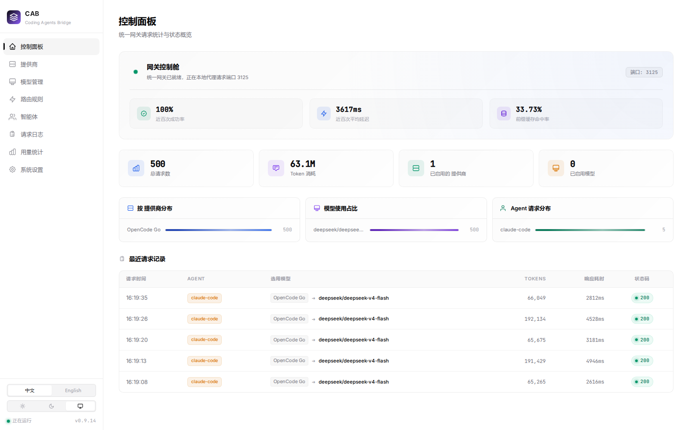
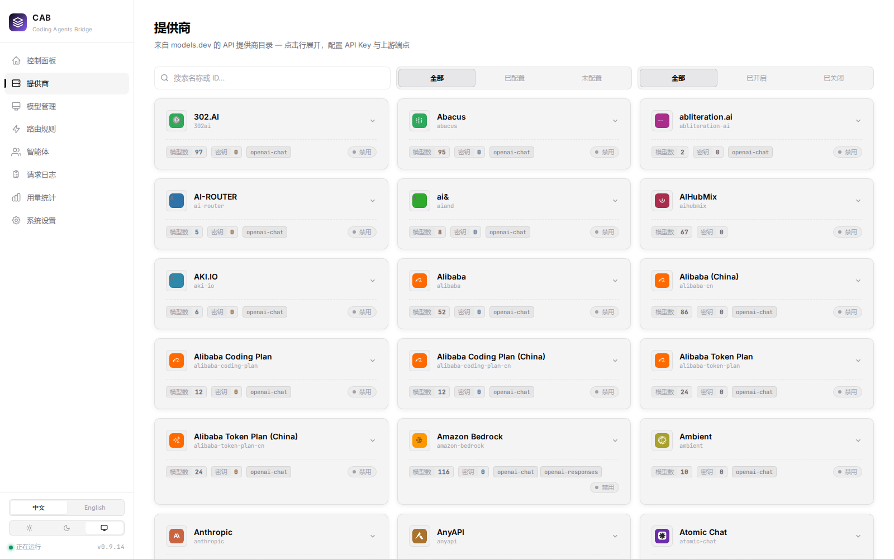
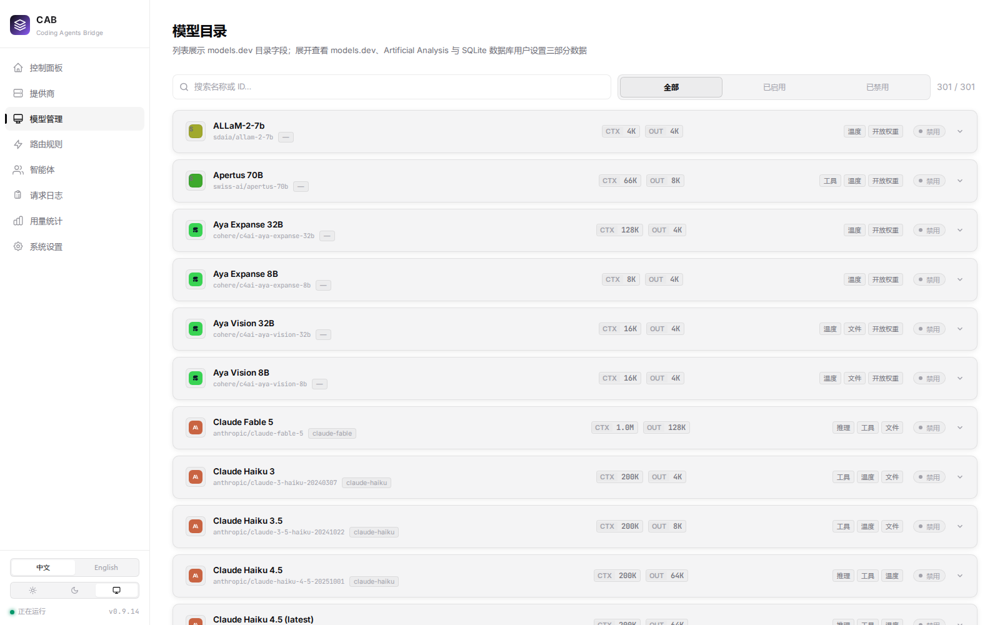
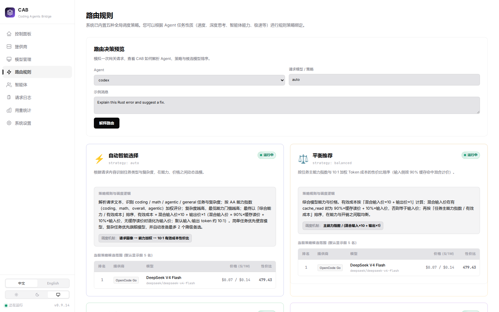
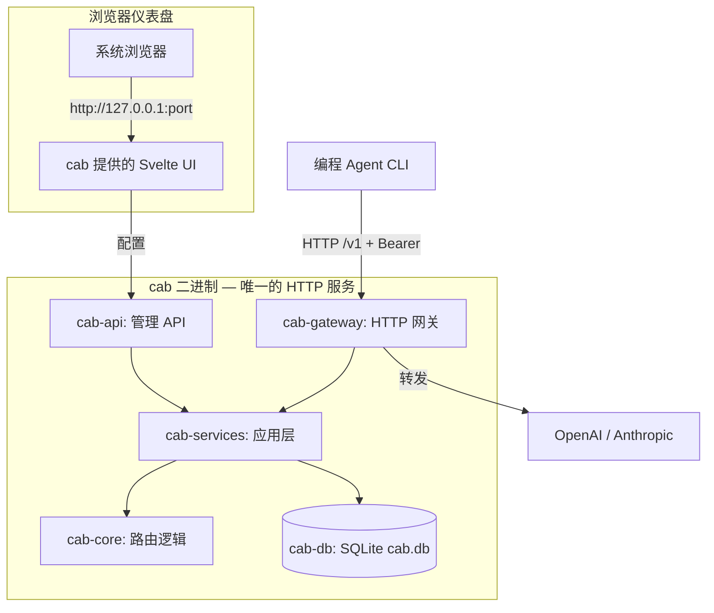

<div align="center">

# CAB — Coding Agents Bridge

**一个本地网关，接入所有编程 Agent。智能、按成本优化的 LLM 路由。**

[English](README.md) · [简体中文](README.zh-CN.md) · [文档站](https://xiongdi.github.io/cab/zh-cn/) · [更新日志](https://xiongdi.github.io/cab/zh-cn/project/changelog/)

[](https://github.com/xiongdi/cab/releases)
[](https://github.com/xiongdi/cab/releases)
[](https://github.com/xiongdi/cab/releases)
[](LICENSE)
[](https://github.com/xiongdi/cab/actions/workflows/build-cli.yml)

</div>

CAB 是一个本地、按成本优化的 LLM 网关路由器，专为编程 Agent 与开发者工作流设计。把 Agent CLI 指向 CAB 网关（默认 `http://localhost:3125/v1`），CAB 会为每个请求在已启用的提供商/模型中智能排序并转发到 OpenAI / Anthropic。不用再手改 JSON、TOML、`.env`，也不用再猜哪个模型最便宜、最快。

> **为什么用 CAB？** 每个编程 Agent 都有自己的 API Key、endpoint 和模型列表。CAB 给你 **一个 endpoint、一把 Key、一个仪表盘** 管全部 —— 并按照能力、benchmark 和真实 token 成本为每个请求路由。

## 界面截图

| 控制面板                                        | 提供商                                          |
| ----------------------------------------------- | ----------------------------------------------- |
|  |  |

| 模型管理                                   | 路由规则                                   |
| ------------------------------------------ | ------------------------------------------ |
|  |  |

## 功能特性

### 路由

- **6 种内置策略** —— auto（智能）、balanced（平衡）、intelligent（代码能力）、price（价格）、speed（速度）、agentic（智能体）—— 按智能 / 代码 / Agentic 指数、AA benchmark、token 定价和上下文窗口对模型排序。
- **默认按成本优化** —— 有效 token 成本会混合 `cache_read` 定价和 10:1 的输入/输出比例，所以"最便宜"真的是*针对你的工作负载最便宜*。
- **请求感知画像** —— CAB 会从每个提示词推断任务类型（coding / math / agentic / general）和复杂度，再套用合适的策略和能力门槛。
- **视觉能力路由** —— 带图片的请求（截图、图表、UI 原型）只会路由到支持图片输入的模型，即使纯文本模型更便宜。
- **自定义路由规则** —— 按 agent 的 glob 匹配规则 + 回退链，还有 "Explain routing" 预览，展示请求具体如何解析。

### 提供商 & 目录

- **models.dev 实时同步** —— 模型、定价、AA benchmark 实时拉取；`architecture.modalities.input` 数据驱动视觉路由。
- **一把 Key 或多把 Key** —— 按请求启用提供商和模型；429 限流时 Key 自动轮换、指数退避、短暂冷却。
- **Endpoint 级定价** —— 使用 models.dev 中每个提供商的真实 endpoint 成本，而非目录默认值。

### 仪表盘

- **浏览器控制台** —— 网关自带的 Svelte UI：提供商、模型、路由、Agent、请求日志、设置。
- **用量与日志** —— 每次请求的提供商、模型、token（缓存腿已归一化）、延迟和成本。

### Agent 切换

- **Auto / Manual / Native 三种模式** —— CAB 自动改写 `~/.claude/settings.json`、`~/.codex/config.toml`、`~/.config/opencode/opencode.json` 或 `~/.grok/config.toml`，并带配置备份。
- **模型固定** —— Manual 模式下，可把 Agent 固定到某个具体模型。

---

## 快速开始

```bash
# Linux / macOS / Git Bash
curl -fsSL https://raw.githubusercontent.com/xiongdi/cab/main/scripts/install.sh | bash

# Windows (PowerShell)
irm https://raw.githubusercontent.com/xiongdi/cab/main/scripts/install.ps1 | iex
```

1. **启动** —— `cab status`，然后 `cab gui` 打开仪表盘（或 `cab serve` 无头运行）。
2. **添加提供商** —— 等目录同步完成，填入 API Key，启用提供商和模型。
3. **复制网关 Key** —— 设置 → 网关 API Key（每个请求的 Bearer token）。
4. **连接 Agent** —— Agent 页 → 选 Auto（套用策略）或 Manual（暴露所有已启用模型）。CAB 会备份并改写 Agent 配置。
5. **发送请求** —— 照常用 Agent CLI。到 **日志** 页确认路由的提供商、模型、token 和延迟。

完整教程见[快速开始指南](https://xiongdi.github.io/cab/zh-cn/getting-started/quick-start/)。

---

## 路由策略

| 策略          | 主键                              | 适用场景                     |
| ------------- | --------------------------------- | ---------------------------- |
| `auto`        | 能力 / 有效成本                   | 默认 —— 能力足够且不超支     |
| `balanced`    | 能力 / 有效成本                   | 通用场景，先能力后成本       |
| `intelligent` | 代码指数                          | 硬核编码问题，按代码能力排序 |
| `agentic`     | Agentic 指数                      | 长周期智能体工作流           |
| `cheapest`    | 有效成本                          | 批量 / 成本敏感场景          |
| `speed`       | TTFT + 1000 / 输出速度\_tps（秒） | 交互式、延迟敏感会话         |

主键数据缺失时无论方向如何都会沉底；同分时按模型名、再按提供商排序。公式细节见[路由指南](https://xiongdi.github.io/cab/zh-cn/guides/routing/)。

---

## 支持的编程 Agent

| Agent       | 配置文件路径                       |
| ----------- | ---------------------------------- |
| Claude Code | `~/.claude/settings.json`          |
| Codex       | `~/.codex/config.toml`             |
| OpenCode    | `~/.config/opencode/opencode.json` |
| Grok Build  | `~/.grok/config.toml`              |

网关通过 User-Agent 字符串识别 Agent。各 Agent 的行为与配置备份见[支持的 Agent](https://xiongdi.github.io/cab/zh-cn/reference/supported-agents/)。

---

## 安装

### 一行安装

```bash
# Linux / macOS / Git Bash
curl -fsSL https://raw.githubusercontent.com/xiongdi/cab/main/scripts/install.sh | bash
# 镜像: curl -fsSL https://xiongdi.github.io/cab/install.sh | bash
```

```powershell
# Windows (PowerShell)
irm https://raw.githubusercontent.com/xiongdi/cab/main/scripts/install.ps1 | iex
# 镜像: irm https://xiongdi.github.io/cab/install.ps1 | iex
```

安装到 `~/.cab/bin`（Windows 为 `%USERPROFILE%\.cab\bin`），把 `cab` 加入 `PATH`，并执行 `cab service install --scope user`。Linux 包为完全静态（musl）构建 —— 无 glibc 版本下限。

```bash
cab status
cab gui          # 浏览器打开仪表盘
cab update       # 之后升级
```

安装选项：

```bash
# bash
curl -fsSL …/install.sh | bash -s -- --version 0.9.0
curl -fsSL …/install.sh | bash -s -- --no-service --no-modify-path

# PowerShell
powershell -NoProfile -ExecutionPolicy Bypass -File install.ps1 -Version 0.9.0
powershell -NoProfile -ExecutionPolicy Bypass -File install.ps1 -NoService -NoModifyPath
```

压缩包、系统要求与故障排查见[安装指南](https://xiongdi.github.io/cab/zh-cn/getting-started/install/)。

### 源码构建

```bash
cargo build --release -p cab
npm install && npm run build        # 仪表盘 UI
./target/release/cab serve
```

---

## 系统架构



| Crate          | 职责                                                    |
| -------------- | ------------------------------------------------------- |
| `cab-core`     | 类型、请求画像、路由/评分算法                           |
| `cab-db`       | SQLite 存储（`~/.cab/cab.db`：设置、Agent、路由、日志） |
| `cab-services` | 目录同步、路由解析、Agent 配置切换                      |
| `cab-gateway`  | 网关鉴权、协议适配、上游转发                            |
| `cab-api`      | 管理 REST API（`/api/*`）                               |
| `cab-srv`      | 库：组合 HTTP 应用（网关 + API + UI）                   |
| `cab`          | 单一二进制：`serve` / 服务控制 / `gui` / `update`       |
| `src`          | Svelte 仪表盘（由 `cab serve` 提供）                    |

详见[架构](https://xiongdi.github.io/cab/zh-cn/reference/architecture/)与 [API 参考](https://xiongdi.github.io/cab/zh-cn/reference/api/)。

---

## 文档

- [文档站](https://xiongdi.github.io/cab/zh-cn/) · [English](https://xiongdi.github.io/cab/)
- [快速开始](https://xiongdi.github.io/cab/zh-cn/getting-started/quick-start/)
- [提供商与模型](https://xiongdi.github.io/cab/zh-cn/guides/providers-and-models/)
- [路由](https://xiongdi.github.io/cab/zh-cn/guides/routing/)
- [网关与鉴权](https://xiongdi.github.io/cab/zh-cn/guides/gateway-auth/)
- [Agent](https://xiongdi.github.io/cab/zh-cn/guides/agents/)
- [更新日志](https://xiongdi.github.io/cab/zh-cn/project/changelog/)

---

## 常见问题

**CAB 支持哪些 Agent？**
目前支持 Claude Code、Codex、OpenCode 和 Grok Build。网关按 User-Agent 字符串匹配，因此可以继续扩展。

**每个 Agent 都要单独一把 Key 吗？**
不用。Auto/Manual 模式的 Agent 统一用网关 Key 作为 Bearer token；上游提供商 Key 由 CAB 统一管理。

**提供商被限流了怎么办？**
CAB 会对同一 Key 做指数退避重试，然后短暂冷却，并回退到下一个 Key 或模型。

**我的数据存在哪里？**
运行时状态在 `~/.cab/cab.db`（SQLite），目录缓存在 `~/.cab/catalog/`。Agent 配置就地改写并带备份。

**某个 Agent 可以绕过 CAB 吗？**
可以 —— 把 Agent 切成 **Native** 模式，CAB 会从备份恢复它原来的配置。

---

## 开发

```bash
cargo fmt --all -- --check          # Rust 格式
cargo clippy --workspace --all-targets -- -D warnings
cargo test --workspace              # 全部 Rust 测试
npm run check                       # Svelte + TypeScript
```

日常开发（两个终端、全局唯一端口）：`npm run dev:server`（后端 :3125）+ `npm run dev`（前端 :5173）。完整规则见 [AGENTS.md](AGENTS.md)。

## 参与贡献

欢迎提交 Pull Request。提交前请确保 `cargo fmt --check`、clippy `-D warnings`、`cargo test --workspace` 全部通过。新功能请先开 issue 讨论。详见 [CONTRIBUTING.md](CONTRIBUTING.md)。

## 许可证

[Auditable Commercial License (ACL) v1.0](LICENSE)
