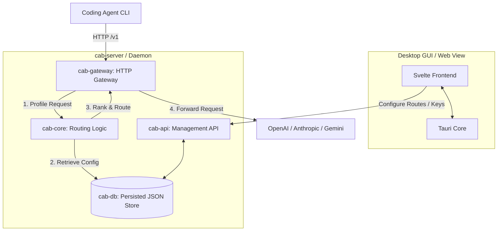

# CAB (Coding Agents Bridge)

[English](../README.md) | [简体中文](README.zh-CN.md) | [日本語](README.ja.md) | [한국어](README.ko.md) | [Español](README.es.md)

CAB (Coding Agents Bridge) es un enrutador local de gateway LLM, sensible al costo, diseñado para agentes de programación y flujos de trabajo de desarrollo. Apunta tu CLI de agente al gateway de CAB (`http://localhost:3125/v1` por defecto); CAB clasifica y reenvía cada solicitud al mejor proveedor/modelo habilitado para ese prompt.

---

## Funciones

- **Gateway OpenAI / Anthropic / Gemini**: expone `/v1/chat/completions`, `/v1/messages`, `/v1/responses` y endpoints compatibles con Gemini en un único puerto HTTP local.
- **Enrutamiento por capacidad y costo**: clasifica modelos usando índices de Intelligence / Coding / Agentic, precio por token y ventana de contexto.
- **Sincronización de catálogo en tiempo real**: obtiene modelos, precios y datos de benchmark desde `models.dev`.
- **Panel de escritorio**: UI con Tauri + Svelte para proveedores, claves, estrategias de enrutamiento, configuración de agentes y logs de solicitudes.
- **Selector de configuración de agentes**: los modos Auto / Manual reescriben configuraciones para Claude Code, Codex, OpenCode, Hermes, Kilo Code, OpenClaw y Pi.

---

## Arquitectura del sistema



| Crate | Rol |
| --- | --- |
| `cab-core` | Tipos, perfilado de solicitudes y algoritmo de enrutamiento |
| `cab-db` | Almacén en memoria + persistencia en `~/.cab/settings.json` |
| `cab-gateway` | Gateway HTTP, traducción de protocolos y reenvío upstream |
| `cab-api` | API REST de administración (`/api/*`) |
| `cab-server` | Daemon headless (gateway + API + UI estática) |
| `src` | Panel Svelte |

---

## Primeros pasos

### Requisitos

- [Rust](https://rustup.rs/) (2024 Edition)
- [Node.js](https://nodejs.org/) (v18+)

### GUI de escritorio (Tauri)

```bash
npm install
npm run tauri:dev
```

### Servidor headless

```bash
cargo run -p cab-server
```

Gateway por defecto: `http://127.0.0.1:3125/v1`

---

## Agentes de programación compatibles (v0.1.0)

| Agent | Integración |
| --- | --- |
| Claude Code | `~/.claude/settings.json` |
| Codex | `~/.codex/config.toml` |
| OpenCode | `~/.config/opencode/opencode.json` |
| Hermes | `~/.hermes/config.yaml` |
| Kilo Code | `~/.config/kilo/opencode.json` |
| OpenClaw | `openclaw config` |
| Pi | `~/.pi/agent/models.json` |

Configura los modos en la página **Agents**: **Native** (omite CAB), **Auto** (estrategia de enrutamiento), **Manual** (expone todos los modelos habilitados).

---

## Licencia

[MIT License](../LICENSE)
