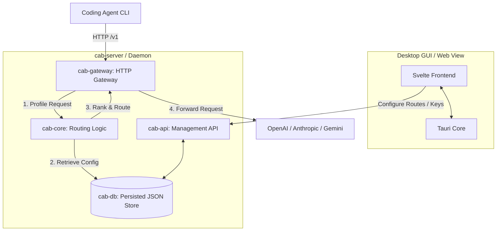

# CAB (Coding Agents Bridge)

[English](../README.md) | [简体中文](README.zh-CN.md) | [日本語](README.ja.md) | [한국어](README.ko.md) | [Español](README.es.md)

CAB (Coding Agents Bridge) は、コーディングエージェントと開発者ワークフロー向けの、ローカルで動作するコスト考慮型 LLM ゲートウェイルーターです。エージェント CLI を CAB ゲートウェイ（既定では `http://localhost:3125/v1`）に向けると、CAB が各プロンプトに最適な有効化済みプロバイダーとモデルを順位付けして転送します。

---

## 機能

- **OpenAI / Anthropic / Gemini ゲートウェイ**：単一のローカル HTTP ポートで `/v1/chat/completions`、`/v1/messages`、`/v1/responses`、Gemini 互換エンドポイントを公開します。
- **能力とコストを考慮したルーティング**：Intelligence / Coding / Agentic 指標、トークン価格、コンテキストウィンドウに基づいてモデルを順位付けします。
- **リアルタイムカタログ同期**：`models.dev` からモデル、価格、ベンチマークデータを取得します。
- **デスクトップダッシュボード**：Tauri + Svelte UI で、プロバイダー、キー、ルーティング戦略、エージェント設定、リクエストログを管理できます。
- **エージェント設定スイッチャー**：Auto / Manual モードで Claude Code、Codex、OpenCode、Hermes、Kilo Code、OpenClaw、Pi の設定を書き換えます。

---

## システム構成



| Crate | 役割 |
| --- | --- |
| `cab-core` | 型、リクエストプロファイリング、ルーティングアルゴリズム |
| `cab-db` | インメモリストア + `~/.cab/settings.json` 永続化 |
| `cab-gateway` | HTTP ゲートウェイ、プロトコル変換、上流への転送 |
| `cab-api` | 管理 REST API（`/api/*`） |
| `cab-server` | ヘッドレスデーモン（ゲートウェイ + API + 静的 UI） |
| `src` | Svelte ダッシュボード |

---

## はじめ方

### 前提条件

- [Rust](https://rustup.rs/)（2024 Edition）
- [Node.js](https://nodejs.org/)（v18+）

### デスクトップ GUI（Tauri）

```bash
npm install
npm run tauri:dev
```

### ヘッドレスサーバー

```bash
cargo run -p cab-server
```

既定のゲートウェイ：`http://127.0.0.1:3125/v1`

---

## 対応コーディングエージェント（v0.1.0）

| Agent | 連携 |
| --- | --- |
| Claude Code | `~/.claude/settings.json` |
| Codex | `~/.codex/config.toml` |
| OpenCode | `~/.config/opencode/opencode.json` |
| Hermes | `~/.hermes/config.yaml` |
| Kilo Code | `~/.config/kilo/opencode.json` |
| OpenClaw | `openclaw config` |
| Pi | `~/.pi/agent/models.json` |

**Agents** ページでモードを設定できます：**Native**（CAB を迂回）、**Auto**（ルーティング戦略）、**Manual**（有効化済みモデルをすべて公開）。

---

## ライセンス

[MIT License](../LICENSE)
