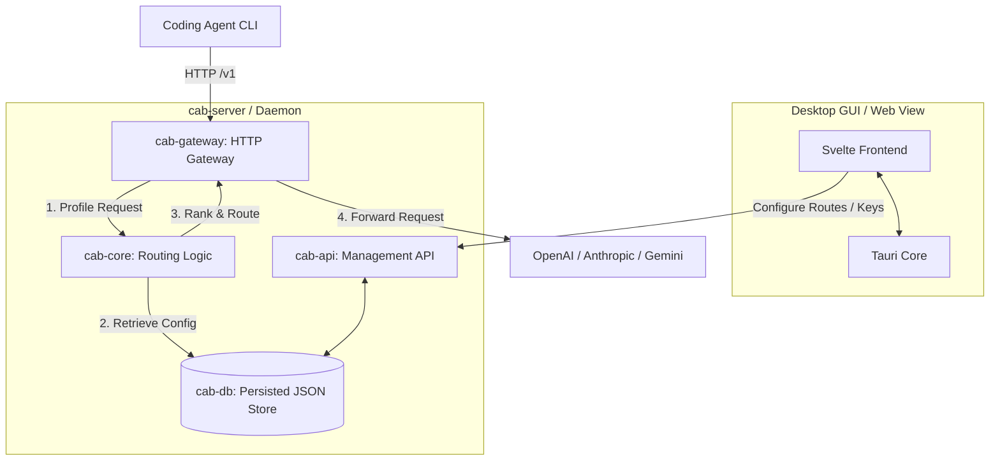

# CAB (Coding Agents Bridge)

[English](../README.md) | [简体中文](README.zh-CN.md) | [日本語](README.ja.md) | [한국어](README.ko.md) | [Español](README.es.md)

CAB (Coding Agents Bridge)는 코딩 에이전트와 개발자 워크플로를 위한 로컬 비용 인식 LLM 게이트웨이 라우터입니다. 에이전트 CLI를 CAB 게이트웨이(기본값 `http://localhost:3125/v1`)로 연결하면, CAB가 각 프롬프트에 가장 적합한 활성 공급자와 모델을 순위화해 요청을 전달합니다.

---

## 기능

- **OpenAI / Anthropic / Gemini 게이트웨이**: 하나의 로컬 HTTP 포트에서 `/v1/chat/completions`, `/v1/messages`, `/v1/responses`, Gemini 호환 엔드포인트를 제공합니다.
- **능력 및 비용 인식 라우팅**: Intelligence / Coding / Agentic 지표, 토큰 가격, 컨텍스트 창을 기반으로 모델을 순위화합니다.
- **실시간 카탈로그 동기화**: `models.dev`에서 모델, 가격, 벤치마크 데이터를 가져옵니다.
- **데스크톱 대시보드**: Tauri + Svelte UI로 공급자, 키, 라우팅 전략, 에이전트 설정, 요청 로그를 관리합니다.
- **에이전트 설정 전환기**: Auto / Manual 모드가 Claude Code, Codex, OpenCode, Hermes, Kilo Code, OpenClaw, Pi 설정을 다시 씁니다.

---

## 시스템 아키텍처



| Crate | 역할 |
| --- | --- |
| `cab-core` | 타입, 요청 프로파일링, 라우팅 알고리즘 |
| `cab-db` | 인메모리 저장소 + `~/.cab/settings.json` 영속화 |
| `cab-gateway` | HTTP 게이트웨이, 프로토콜 변환, 업스트림 전달 |
| `cab-api` | 관리 REST API(`/api/*`) |
| `cab-server` | 헤드리스 데몬(게이트웨이 + API + 정적 UI) |
| `src` | Svelte 대시보드 |

---

## 시작하기

### 필수 조건

- [Rust](https://rustup.rs/) (2024 Edition)
- [Node.js](https://nodejs.org/) (v18+)

### 데스크톱 GUI (Tauri)

```bash
npm install
npm run tauri:dev
```

### 헤드리스 서버

```bash
cargo run -p cab-server
```

기본 게이트웨이: `http://127.0.0.1:3125/v1`

---

## 지원하는 코딩 에이전트 (v0.1.0)

| Agent | 연동 |
| --- | --- |
| Claude Code | `~/.claude/settings.json` |
| Codex | `~/.codex/config.toml` |
| OpenCode | `~/.config/opencode/opencode.json` |
| Hermes | `~/.hermes/config.yaml` |
| Kilo Code | `~/.config/kilo/opencode.json` |
| OpenClaw | `openclaw config` |
| Pi | `~/.pi/agent/models.json` |

**Agents** 페이지에서 모드를 설정합니다: **Native**(CAB 우회), **Auto**(라우팅 전략), **Manual**(활성화된 모든 모델 노출).

---

## 라이선스

[MIT License](../LICENSE)
