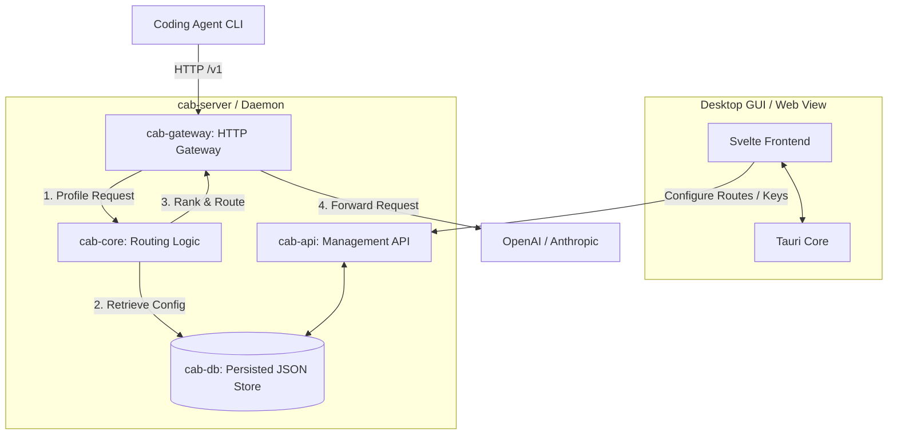

# CAB (Coding Agents Bridge)

[English](../README.md) | [简体中文](README.zh-CN.md)

CAB (Coding Agents Bridge) 是一个面向编码代理和开发者工作流的本地、成本感知型 LLM 网关路由器。将 Agent CLI 指向 CAB 网关（默认 `http://localhost:3125/v1`）；CAB 会按路由策略从已启用的 LLM 提供商与模型中选择目标并转发请求。

---

## 功能

- **OpenAI / Anthropic 网关**：在同一个本地 HTTP 端口暴露 `/v1/chat/completions`、`/v1/messages` 和 `/v1/responses`。
- **能力与成本感知路由**：根据 Intelligence / Coding / Agentic 指标、token 价格和上下文窗口对模型排序。
- **实时目录同步**：从 `models.dev` 拉取模型、价格和基准数据。
- **桌面仪表盘**：基于 Tauri + Svelte 的 UI，用于管理 LLM 提供商、API Key、路由策略、Agent 配置和请求日志。
- **代理配置切换器**：Auto / Manual 模式可改写 Claude Code、Codex、OpenCode、Hermes、Kilo Code、OpenClaw 和 Pi 的配置。

---

## 系统架构



| Crate         | 作用                                     |
| ------------- | ---------------------------------------- |
| `cab-core`    | 类型、请求画像、路由算法                 |
| `cab-db`      | 内存存储 + `~/.cab/settings.json` 持久化 |
| `cab-gateway` | HTTP 网关、协议转换、上游转发            |
| `cab-api`     | 管理 REST API（`/api/*`）                |
| `cab-server`  | 无头守护进程（网关 + API + 静态 UI）     |
| `src`         | Svelte 仪表盘                            |

---

## 快速开始

### 前置条件

- [Rust](https://rustup.rs/)（2024 Edition）
- [Node.js](https://nodejs.org/)（v18+）

### 桌面 GUI（Tauri）

```bash
npm install
npm run tauri:dev
```

### 无头服务

```bash
cargo run -p cab-server
```

默认网关：`http://127.0.0.1:3125/v1`

---

## 支持的编码代理（v0.1.0）

| Agent       | 集成                               |
| ----------- | ---------------------------------- |
| Claude Code | `~/.claude/settings.json`          |
| Codex       | `~/.codex/config.toml`             |
| OpenCode    | `~/.config/opencode/opencode.json` |
| Hermes      | `~/.hermes/config.yaml`            |
| Kilo Code   | `~/.config/kilo/opencode.json`     |
| OpenClaw    | `openclaw config`                  |
| Pi          | `~/.pi/agent/models.json`          |

在 **Agents** 页面配置模式：**Native**（绕过 CAB）、**Auto**（路由策略）、**Manual**（暴露所有已启用模型）。

---

## 许可证

[MIT License](../LICENSE)
