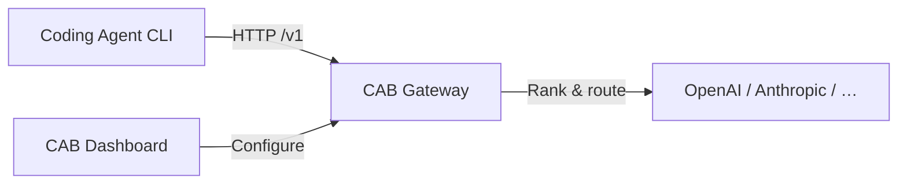

import { Card, CardGrid } from '@astrojs/starlight/components';

## Why CAB?

Coding agents each expect their own API keys, endpoints, and model lists. CAB sits between your agent CLIs and upstream LLM providers — one local gateway at `http://127.0.0.1:3125/v1` that routes every request to the best enabled model for the job.

<CardGrid stagger>
  <Card title="One gateway, many agents" icon="rocket">
    Claude Code, Codex, OpenCode, Hermes, Kilo Code, OpenClaw, Pi, and Reasonix — all point at the
    same local CAB endpoint.
  </Card>
  <Card title="Smart routing" icon="setting">
    Pick a strategy — auto, balanced, intelligent, price, speed, or agentic — and CAB ranks models
    by capability, benchmarks, and token cost.
  </Card>
  <Card title="Desktop control plane" icon="laptop">
    Tauri + Svelte dashboard for providers, models, routes, agents, logs, and settings.
  </Card>
  <Card title="OpenAI + Anthropic compatible" icon="document">
    `/v1/chat/completions`, `/v1/messages`, and `/v1/responses` on a single port with protocol
    conversion when needed.
  </Card>
</CardGrid>

## How it works

1. **Install** CAB and launch the desktop app or headless server.
2. **Add providers** — sync the models.dev catalog and enter API keys.
3. **Connect agents** — switch an agent to Auto or Manual mode; CAB rewrites its config automatically.

## Built-in routing strategies

| Strategy        | Best for                                                         |
| --------------- | ---------------------------------------------------------------- |
| **Auto**        | Dynamic selection by task type, complexity, capability, and cost |
| **Balanced**    | Best value — capability vs. 10:1 weighted token cost             |
| **Intelligent** | Hardest coding tasks — highest AA coding index                   |
| **Agentic**     | Tool-heavy / multi-step workflows — highest AA agentic index     |
| **Price**       | Lowest cost — cheapest enabled model every time                  |
| **Speed**       | Lowest total response time (`TTFT + 1000/tps`)                   |

See [Routing strategies](guides/routing/) for details.

## What's in the dashboard?

| Page          | Purpose                                      |
| ------------- | -------------------------------------------- |
| **Dashboard** | Gateway stats and health overview            |
| **Providers** | LLM provider catalog, API keys, endpoints    |
| **Models**    | Model benchmarks, pricing, enable/disable    |
| **Routes**    | Custom routing rules and decision preview    |
| **Agents**    | Native / Auto / Manual mode per coding agent |
| **Logs**      | Request audit trail (SQLite)                 |
| **Settings**  | Port, gateway key, log retention             |

## Get started

<CardGrid>
  <Card title="Install" icon="download" link="getting-started/install/">
    Download desktop installers for Windows, macOS, and Linux.
  </Card>
  <Card title="Quick Start" icon="rocket" link="getting-started/quick-start/">
    Go from zero to a routed agent request in five minutes.
  </Card>
  <Card title="Agent setup" icon="approve-check" link="guides/agents/">
    Native, Auto, and Manual modes explained.
  </Card>
</CardGrid>
