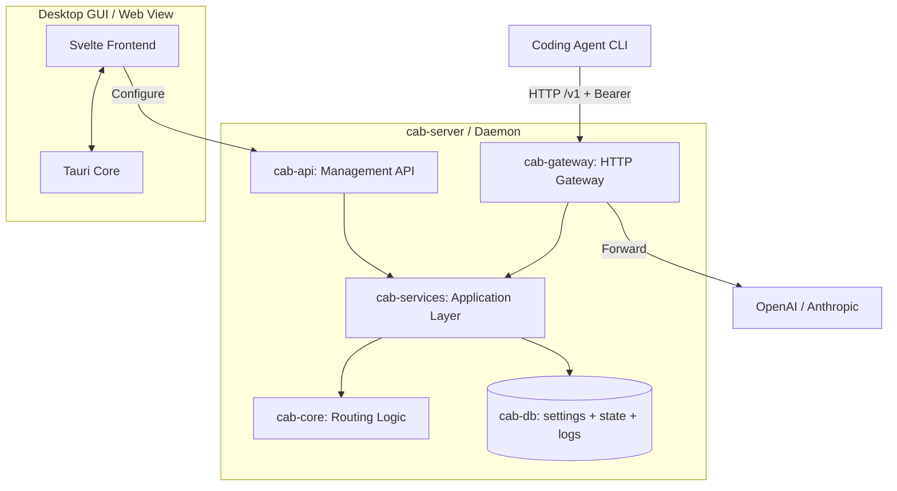

import { Card, CardGrid } from '@astrojs/starlight/components';

## What is CAB?

CAB (Coding Agents Bridge) is a local, cost-aware LLM gateway router designed for coding agents and developer workflows. Point your agent CLI at the CAB gateway (`http://localhost:3125/v1` by default); CAB ranks and forwards requests to the best enabled provider/model for each prompt.

## Features

<CardGrid stagger>
	<Card title="OpenAI / Anthropic gateway" icon="rocket">
		Exposes `/v1/chat/completions`, `/v1/messages`, and `/v1/responses` on a single local HTTP port.
	</Card>
	<Card title="Ability & cost-aware routing" icon="setting">
		Ranks models using Intelligence / Coding / Agentic indices, token pricing, and context window.
	</Card>
	<Card title="Real-time catalog sync" icon="document">
		Pulls models, pricing, and benchmark data from `models.dev`.
	</Card>
	<Card title="Desktop dashboard" icon="laptop">
		Tauri + Svelte UI for providers, keys, routing strategies, agent config, and request logs.
	</Card>
	<Card title="Agent config switcher" icon="approve-check">
		Auto/Manual modes rewrite configs for Claude Code, Codex, OpenCode, Hermes, Kilo Code, OpenClaw, and Pi.
	</Card>
</CardGrid>

## System architecture



| Crate          | Role                                             |
| -------------- | ------------------------------------------------ |
| `cab-core`     | Types, request profiling, routing algorithm      |
| `cab-db`       | Store, `settings.json`, `state.json`, JSONL logs |
| `cab-services` | Catalog sync, route resolution, agent config     |
| `cab-gateway`  | Auth, protocol adapters, upstream forwarding     |
| `cab-api`      | Management REST API (`/api/*`)                   |
| `cab-server`   | Headless daemon (gateway + API + static UI)      |
| `src`          | Svelte dashboard                                 |

## Quick start

**Install a release:** see the [Installation Guide](/install/) on [GitHub Releases](https://github.com/xiongdi/cab/releases).

### Prerequisites

- [Rust](https://rustup.rs/) (2024 Edition, `stable` via `rust-toolchain.toml`)
- [Node.js](https://nodejs.org/) (v24+, LTS)

### Desktop GUI (Tauri)

```bash
npm install
npm run tauri:dev
```

### Headless server

```bash
cargo run -p cab-server
```

Default gateway: `http://127.0.0.1:3125/v1`
