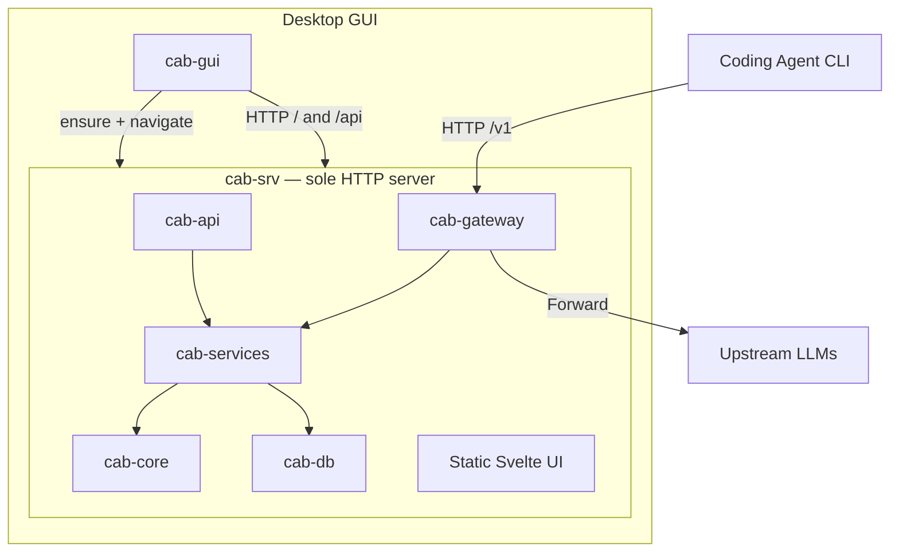

CAB is a Rust HTTP daemon (`cab-srv`) plus a thin Tauri desktop shell (`cab-gui`) that opens the daemon’s UI.

## Process model

| Process   | Role                                                                                                                                                                                                                     |
| --------- | ------------------------------------------------------------------------------------------------------------------------------------------------------------------------------------------------------------------------ | ------------------------------------ |
| `cab-srv` | **Only** process that binds `gateway_port` (default 3125). Serves `/v1`, `/api`, and the dashboard.                                                                                                                      |
| `cab-gui` | Ensures `cab-srv` is running (`cab-cli service install --scope …` / `start`), then WebView → `http://127.0.0.1:{port}/`. First run prompts for user vs system scope if unset. Closing the GUI leaves the daemon running. |
| `cab-cli` | Daemon install/start/stop (`--scope user                                                                                                                                                                                 | system`) and management API helpers. |

Do **not** run two gateways on the same port. Daily development still uses `npm run dev:server` (one `cab-srv` via cargo watch) + `npm run dev` (Vite on 5173).

## Crates

| Crate          | Role                                                                |
| -------------- | ------------------------------------------------------------------- |
| `cab-core`     | Types, request profiling, routing algorithm, ranking                |
| `cab-db`       | SQLite store at `~/.cab/cab.db` (settings, agents, routes, logs, …) |
| `cab-services` | Catalog sync, route resolution, agent config rewrites               |
| `cab-gateway`  | Auth, protocol adapters, upstream forwarding                        |
| `cab-api`      | Management REST API (`/api/*`)                                      |
| `cab-srv`      | Headless daemon — gateway + API + static UI (`crates/cab-server`)   |
| `cab`          | CLI binary `cab-cli`                                                |
| `src/`         | Svelte dashboard (served by `cab-srv`)                              |
| `src-tauri/`   | Thin desktop shell                                                  |

## Request flow

1. Agent sends HTTP request to `http://127.0.0.1:3125/v1/...` with Bearer auth.
2. **cab-gateway** authenticates, identifies the agent, and parses the protocol.
3. **cab-services** resolves the route — agent strategy, custom rules, or explicit model.
4. **cab-core** ranks candidate models using benchmarks, pricing, and request profile.
5. **cab-gateway** forwards to the upstream provider, with protocol conversion and fallbacks.
6. Response returns to the agent; request metadata is stored in SQLite `request_logs`.

## Data persistence

| Store                    | Path                                                                                 | Notes                                   |
| ------------------------ | ------------------------------------------------------------------------------------ | --------------------------------------- |
| Runtime DB               | `$CAB_HOME/cab.db` (default `~/.cab/cab.db`; system scope uses `/var/lib/cab`, etc.) | Settings, agents, routes, logs, catalog |
| Catalog cache (optional) | `$CAB_HOME/catalog/`                                                                 | models.dev download cache               |
| Service scope            | `$CAB_HOME/service.json`                                                             | Records `user` vs `system` install      |
| Bootstrap                | `cab.toml`                                                                           | Host + first-install port seed          |

Deprecated (not used as runtime config): `~/.cab/settings.json`, `~/.cab/state.json`, `~/.cab/logs/*.jsonl`.

## Tech stack

- **Backend**: Rust 2024 Edition, Axum HTTP, async Tokio
- **Frontend**: Svelte 5, SvelteKit, Vite+
- **Desktop**: Tauri 2 (thin client over `cab-srv`)
- **Catalog**: models.dev sync, Artificial Analysis benchmarks
