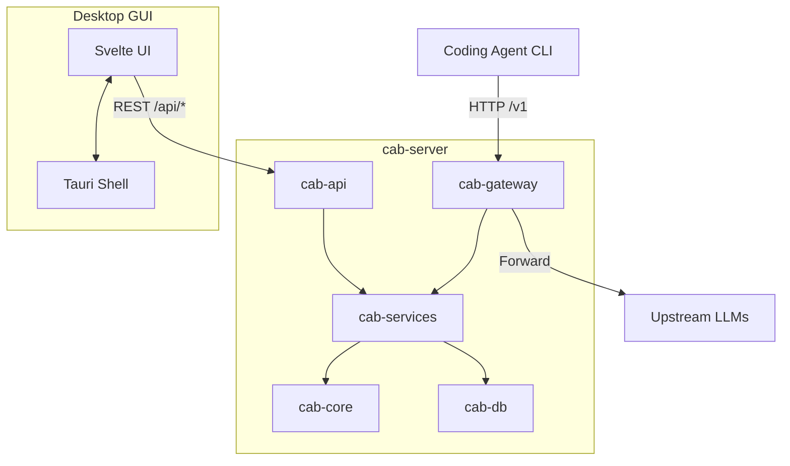

CAB is a Rust backend (gateway + services + routing) with a Tauri + Svelte desktop frontend.

## Crates

| Crate | Role |
| ----- | ---- |
| `cab-core` | Types, request profiling, routing algorithm, ranking |
| `cab-db` | Persistent store — `settings.json`, `state.json`, JSONL logs |
| `cab-services` | Catalog sync, route resolution, agent config rewrites |
| `cab-gateway` | Auth, protocol adapters, upstream forwarding |
| `cab-api` | Management REST API (`/api/*`) |
| `cab-server` | Headless daemon — gateway + API + static UI |
| `src/` | Svelte dashboard |

## Request flow

1. Agent sends HTTP request to `http://127.0.0.1:3125/v1/...` with Bearer auth.
2. **cab-gateway** authenticates, identifies the agent, and parses the protocol.
3. **cab-services** resolves the route — agent strategy, custom rules, or explicit model.
4. **cab-core** ranks candidate models using benchmarks, pricing, and request profile.
5. **cab-gateway** forwards to the upstream provider, with protocol conversion and fallbacks.
6. Response returns to the agent; request metadata is logged to `~/.cab/logs/`.

## Data persistence

| Store | Path | Since |
| ----- | ---- | ----- |
| Settings | `~/.cab/settings.json` | v0.1.0 |
| Agent/route state | `~/.cab/state.json` | v0.2.0 |
| Request logs | `~/.cab/logs/*.jsonl` | v0.2.0 |

## Tech stack

- **Backend**: Rust 2024 Edition, Axum HTTP, async Tokio
- **Frontend**: Svelte 5, SvelteKit, Vite+
- **Desktop**: Tauri 2
- **Catalog**: models.dev sync, Artificial Analysis benchmarks
