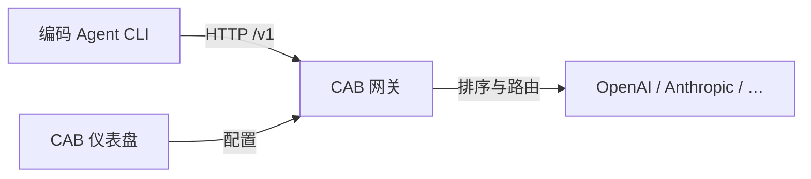

import { Card, CardGrid } from '@astrojs/starlight/components';

## 为什么选择 CAB？

每个编码代理都有自己的 API Key、端点和模型列表。CAB 坐在 Agent CLI 与上游 LLM 提供商之间——一个本地网关 `http://127.0.0.1:3125/v1`，为每次请求选择最合适的已启用模型。

<CardGrid stagger>
  <Card title="一个网关，多个 Agent" icon="rocket">
    Claude Code、Codex、OpenCode、Hermes、Kilo Code、OpenClaw、Pi、Reasonix——全部指向同一个 CAB 本地端点。
  </Card>
  <Card title="智能路由" icon="setting">
    选择策略——auto、balanced、intelligent、price、speed 或 agentic——CAB 按能力、基准数据和 token 成本排序选模。
  </Card>
  <Card title="桌面控制台" icon="laptop">
    基于 Tauri + Svelte 的仪表盘，管理提供商、模型、路由、Agent、日志和设置。
  </Card>
  <Card title="OpenAI + Anthropic 兼容" icon="document">
    同一端口暴露 `/v1/chat/completions`、`/v1/messages`、`/v1/responses`，必要时自动协议转换。
  </Card>
</CardGrid>

## 工作原理

1. **安装** CAB，启动桌面应用或无头服务。
2. **添加提供商**——同步 models.dev 目录并填入 API Key。
3. **连接 Agent**——切换为自动或手动模式，CAB 自动改写 Agent 配置。

## 内置路由策略

| 策略            | 适用场景                               |
| --------------- | -------------------------------------- |
| **Auto**        | 按任务类型、复杂度、能力与成本动态选模 |
| **Balanced**    | 性价比最优——能力与 10:1 加权 token 成本 |
| **Intelligent** | 最难的编程任务——AA coding index 最高   |
| **Agentic**     | 工具密集 / 多步工作流——AA agentic index 最高 |
| **Price**       | 成本最低——始终选最便宜的已启用模型     |
| **Speed**       | 总响应时间最低（`TTFT + 1000/tps`）    |

详见 [路由策略](guides/routing/)。

## 仪表盘功能

| 页面         | 用途                              |
| ------------ | --------------------------------- |
| **控制面板** | 网关统计与健康概览                |
| **提供商**   | LLM 目录、API Key、上游端点       |
| **模型**     | 基准数据、定价、启用/禁用         |
| **路由**     | 自定义路由规则与决策预览          |
| **Agent**    | 各编码 Agent 的原生/自动/手动模式 |
| **日志**     | 请求审计（SQLite）                |
| **设置**     | 端口、网关密钥、日志保留          |

## 开始使用

<CardGrid>
  <Card title="安装" icon="download" link="getting-started/install/">
    下载 Windows、macOS、Linux 桌面安装包。
  </Card>
  <Card title="快速开始" icon="rocket" link="getting-started/quick-start/">
    五分钟完成从安装到首次路由请求。
  </Card>
  <Card title="Agent 配置" icon="approve-check" link="guides/agents/">
    原生、自动、手动三种模式详解。
  </Card>
</CardGrid>
