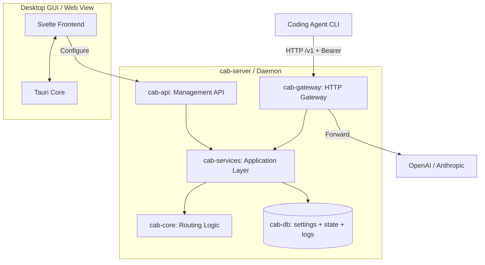

import { Card, CardGrid } from '@astrojs/starlight/components';

## 什么是 CAB？

CAB (Coding Agents Bridge) 是一个面向编码代理和开发者工作流的本地、成本感知型 LLM 网关路由器。将 Agent CLI 指向 CAB 网关（默认 `http://localhost:3125/v1`）；CAB 会按路由策略从已启用的 LLM 提供商与模型中选择目标并转发请求。

## 功能

<CardGrid stagger>
	<Card title="OpenAI / Anthropic 网关" icon="rocket">
		在同一个本地 HTTP 端口暴露 `/v1/chat/completions`、`/v1/messages` 和 `/v1/responses`。
	</Card>
	<Card title="能力与成本感知路由" icon="setting">
		根据 Intelligence / Coding / Agentic 指标、token 价格和上下文窗口对模型排序。
	</Card>
	<Card title="实时目录同步" icon="document">
		从 `models.dev` 拉取模型、价格和基准数据。
	</Card>
	<Card title="桌面仪表盘" icon="laptop">
		基于 Tauri + Svelte 的 UI，用于管理 LLM 提供商、API Key、路由策略、Agent 配置和请求日志。
	</Card>
	<Card title="代理配置切换器" icon="approve-check">
		Auto / Manual 模式可改写 Claude Code、Codex、OpenCode、Hermes、Kilo Code、OpenClaw 和 Pi 的配置。
	</Card>
</CardGrid>

## 系统架构



| Crate          | 作用                                     |
| -------------- | ---------------------------------------- |
| `cab-core`     | 类型、请求画像、路由算法                 |
| `cab-db`       | 存储、`settings.json`、`state.json`、JSONL 日志 |
| `cab-services` | 目录同步、路由解析、Agent 配置           |
| `cab-gateway`  | 认证、协议适配、上游转发                 |
| `cab-api`      | 管理 REST API（`/api/*`）                |
| `cab-server`   | 无头守护进程（网关 + API + 静态 UI）     |
| `src`          | Svelte 仪表盘                            |

## 快速开始

**安装发布版：** 请参阅 [安装指南](/zh-cn/install/)，在 [GitHub Releases](https://github.com/xiongdi/cab/releases) 下载对应平台的安装包。

### 前置条件

- [Rust](https://rustup.rs/)（2024 Edition，`rust-toolchain.toml` 使用 `stable`）
- [Node.js](https://nodejs.org/)（v24+，LTS）

### 桌面 GUI（Tauri）

```bash
npm install
npm run tauri:dev
```

### 无头服务

```bash
cargo run -p cab-server
```

默认网关：`http://127.0.0.1:3125/v1`
