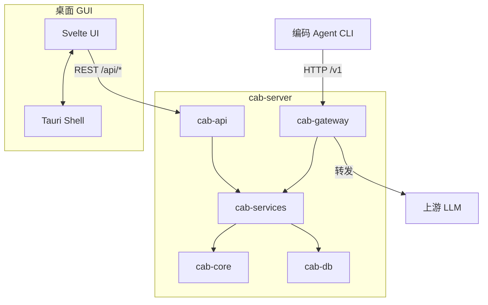

CAB 由 Rust 后端（网关 + 服务 + 路由）和 Tauri + Svelte 桌面前端组成。

## Crate 分工

| Crate | 职责 |
| ----- | ---- |
| `cab-core` | 类型、请求画像、路由算法、排序 |
| `cab-db` | 持久化存储——`settings.json`、`state.json`、JSONL 日志 |
| `cab-services` | 目录同步、路由解析、Agent 配置改写 |
| `cab-gateway` | 认证、协议适配、上游转发 |
| `cab-api` | 管理 REST API（`/api/*`） |
| `cab-server` | 无头守护进程——网关 + API + 静态 UI |
| `src/` | Svelte 仪表盘 |

## 请求流程

1. Agent 向 `http://127.0.0.1:3125/v1/...` 发送 HTTP 请求，携带 Bearer 认证。
2. **cab-gateway** 认证、识别 Agent、解析协议。
3. **cab-services** 解析路由——Agent 策略、自定义规则或显式模型。
4. **cab-core** 按基准、定价和请求画像排序候选模型。
5. **cab-gateway** 转发到上游提供商，含协议转换与降级。
6. 响应返回 Agent；请求元数据写入 `~/.cab/logs/`。

## 数据持久化

| 存储 | 路径 | 起始版本 |
| ---- | ---- | -------- |
| 设置 | `~/.cab/settings.json` | v0.1.0 |
| Agent/路由状态 | `~/.cab/state.json` | v0.2.0 |
| 请求日志 | `~/.cab/logs/*.jsonl` | v0.2.0 |

## 技术栈

- **后端**：Rust 2024 Edition、Axum HTTP、async Tokio
- **前端**：Svelte 5、SvelteKit、Vite+
- **桌面**：Tauri 2
- **目录**：models.dev 同步、Artificial Analysis 基准
