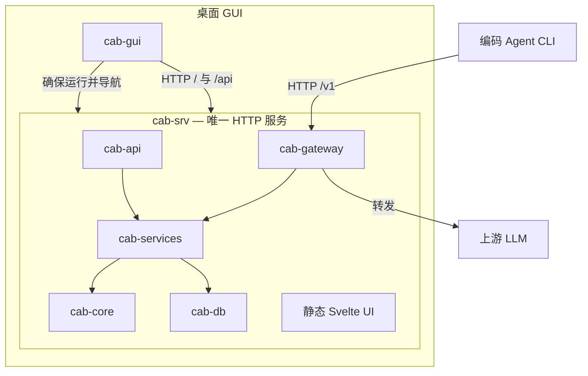

CAB 由 Rust HTTP 守护进程（`cab-srv`）与精简的 Tauri 桌面壳（`cab-gui`）组成；GUI 打开 daemon 提供的 UI。

## 进程模型

| 进程      | 职责                                                                                                                                                                                |
| --------- | ----------------------------------------------------------------------------------------------------------------------------------------------------------------------------------- | ------------------------ |
| `cab-srv` | **唯一**绑定 `gateway_port`（默认 3125）的进程，提供 `/v1`、`/api` 与仪表盘                                                                                                         |
| `cab-gui` | 确保 `cab-srv` 运行（`cab-cli service install --scope …` / `start`），WebView 打开 `http://127.0.0.1:{port}/`；首次若未安装服务会提示选择用户级/系统级；关闭 GUI 后 daemon 继续常驻 |
| `cab-cli` | 守护进程安装/启停（`--scope user                                                                                                                                                    | system`）与管理 API 辅助 |

不要在同一端口上叠两个网关。日常开发仍用 `npm run dev:server`（一个 cargo-watch 的 `cab-srv`）+ `npm run dev`（Vite :5173）。

## Crate 分工

| Crate          | 职责                                                      |
| -------------- | --------------------------------------------------------- |
| `cab-core`     | 类型、请求画像、路由算法、排序                            |
| `cab-db`       | SQLite 存储 `~/.cab/cab.db`（设置、Agent、路由、日志等）  |
| `cab-services` | 目录同步、路由解析、Agent 配置改写                        |
| `cab-gateway`  | 认证、协议适配、上游转发                                  |
| `cab-api`      | 管理 REST API（`/api/*`）                                 |
| `cab-srv`      | 无头守护进程——网关 + API + 静态 UI（`crates/cab-server`） |
| `cab`          | CLI 二进制 `cab-cli`                                      |
| `src/`         | Svelte 仪表盘（由 `cab-srv` 提供）                        |
| `src-tauri/`   | 精简桌面壳                                                |

## 请求流程

1. Agent 向 `http://127.0.0.1:3125/v1/...` 发送 HTTP 请求，携带 Bearer 认证。
2. **cab-gateway** 认证、识别 Agent、解析协议。
3. **cab-services** 解析路由——Agent 策略、自定义规则或显式模型。
4. **cab-core** 按基准、定价和请求画像排序候选模型。
5. **cab-gateway** 转发到上游提供商，含协议转换与降级。
6. 响应返回 Agent；请求元数据写入 SQLite `request_logs`。

## 数据持久化

| 存储             | 路径                                                                   | 说明                          |
| ---------------- | ---------------------------------------------------------------------- | ----------------------------- |
| 运行时数据库     | `$CAB_HOME/cab.db`（默认 `~/.cab/cab.db`；系统级为 `/var/lib/cab` 等） | 设置、Agent、路由、日志、目录 |
| 目录缓存（可选） | `$CAB_HOME/catalog/`                                                   | models.dev 下载缓存           |
| 服务范围         | `$CAB_HOME/service.json`                                               | 记录 `user` / `system` 安装   |
| 系统引导         | `cab.toml`                                                             | Host + 首次安装端口种子       |

已废弃（勿作运行时配置）：`~/.cab/settings.json`、`~/.cab/state.json`、`~/.cab/logs/*.jsonl`。

## 技术栈

- **后端**：Rust 2024 Edition、Axum HTTP、async Tokio
- **前端**：Svelte 5、SvelteKit、Vite+
- **桌面**：Tauri 2（通过 `cab-srv` 的薄客户端）
- **目录**：models.dev 同步、Artificial Analysis 基准
